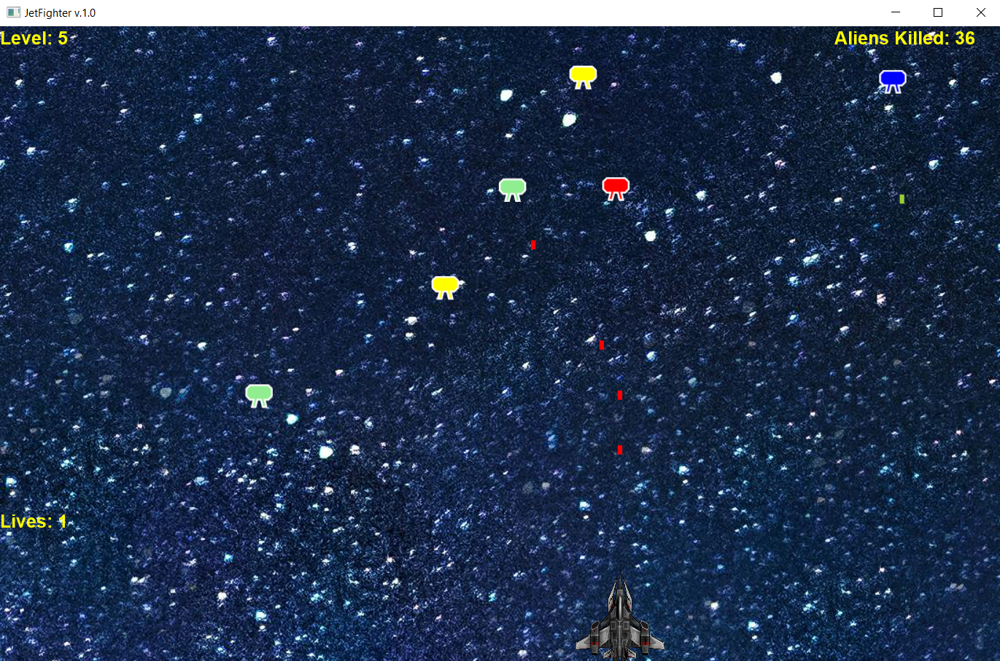

# Overview
The Jet Fighter game is created using JDK 21.0.2 and JavaFX. It is an arcade-style game where the player controls a jet 
fighter to shoot down alien invaders while avoiding enemy projectiles. The game features dynamic gameplay, 
multiple levels, and a scoring system.

## Installation
To run the Jet Fighter game, ensure you have Java Development Kit (JDK) installed on your system. Then, follow these steps:

1. Clone or download the project repository.
2. Open the project in your preferred Java IDE.
3. Run the JetFighterDriver class to start the game.

## Gameplay
- Controls: Use the left and right arrow keys to move the player's jet fighter horizontally. 
Press the space-bar to shoot projectiles at the alien invaders.
- Objective: The goal is to eliminate all alien invaders while avoiding their projectiles. 
Each alien shot down earns the player points, and the game progresses through multiple levels of increasing difficulty.
- Lives: The player starts with a certain number of lives, and the game ends when all lives are lost.

## Required Elements

| Required Elements  | Example location                                                            |
|--------------------|-----------------------------------------------------------------------------|
| interfaces         | Movement Interface implemented by Alien.java and Projectile.java            |
| enum               | AlienColor.java is an enum of colors                                        | 
| class              | JetFighterDriver.java extends Application.java                              |
| instance variables | ArrayList<Alien> aliens is an instance variable of the JetFighterMain.java  |
| methods            | public void move() is a method implemented in Alien.java                    |
| static members     | public static final int HEIGHT is the initial y-axis location of the player |

